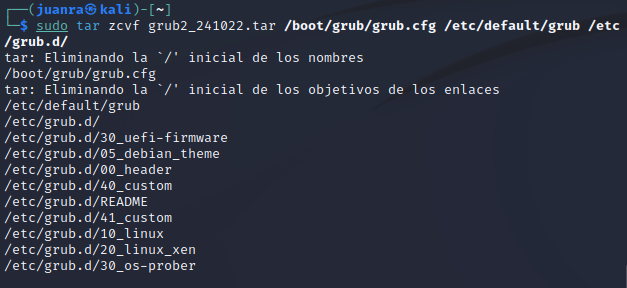
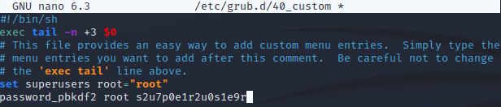
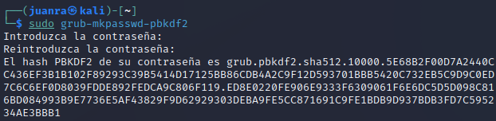

author: Juan Ramón González Hurtado
summary: Guía para bastionado de GRUB
id: hardening_guia_grub
categories: codelab,markdown 
environments: Web 
status: Published 

# Bastionado del GRUB

## Ocultación del gestor de arranque GRUB

GRUB es un gestor de arranque que se suele instalar por defecto en los sistemas linux y posee ciertas vulnerabilidades que podríamos solucionar. En primer lugar tenemos que acceder al archivo de configuración de GRUB

Se encuentra en el directorio <b>/etc/default/grub</b>, para editarlo introducimos el comando `sudo nano /etc/default/grub`

Cambiamos <b>GRUB_TIMEOUT=5</b> a <b>GRUB_TIMEOUT=0</b>

Guardamos los cambios en el archivo y ejecutamos el comando `sudo grub-update`

## Establecer una contraseña de arranque

Otra posible capa de seguridad sería establecer una contraseña de arranque. Para proteger el arranque con una contraseña editamos el archivo de configuración `/etc/grub.d/40_custom`:

Importante guardar los cambios ejecutando `sudo grub-update`:

Como podemos comprobar nos pide la contraseña de arranque:

## Respaldo de archivos de configuración

Para proteger aún más la configuración de nuestro sistema de arranque podríamos hacer una copia de seguridad de los ficheros de configuración de GRUB.

Ahora procedemos a crear una copia comprimida de los ficheros de configuración con el comando `sudo tar zcvf grub2_241022.tar /boot/grub/grub.cfg /etc/default/grub /etc/grub.d/`

Importante indicar la fecha, e incluso la hora del respaldo, porque puede ayudar de cara al futuro para llevar un control de la última vez que se realizó un respaldo.

## Otras opciones de seguridad

Ahora contemplaremos otras opciones de seguridad complentarias a las anteriormente vistas en esta guía.

### Cifrado de la contraseña de arranque

Si bien es cierto que podemos añadir una contraseña de arranque, esta figura en el fichero de configuración y no está cifrada. 

De esta manera podremos dejar la contraseña cifrada. Tenemos que cambiar el parámetro "password" por "password_pbkdf2" en el fichero `/etc/grub.d/40_custom`.

Una vez hecho esto, ejecutamos el comando `sudo grub-mkpasswd-pbkdf2` para cifrar la contraseña del fichero:

### Edición de permisos de archivos de configuración de GRUB2

Nunca está de más retirar los permisos de los archivos de configuración. Vamos a usar el comando `chmod` para el fichero anterior.

Introducimos el siguiente comando en la terminal `sudo chmod 700 /etc/grub.d/40_custom`

