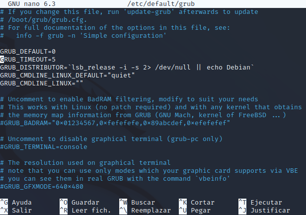
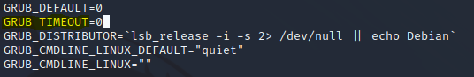
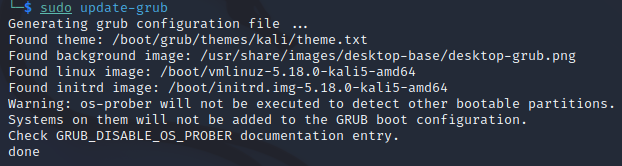
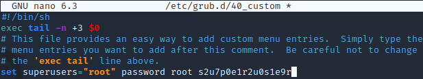
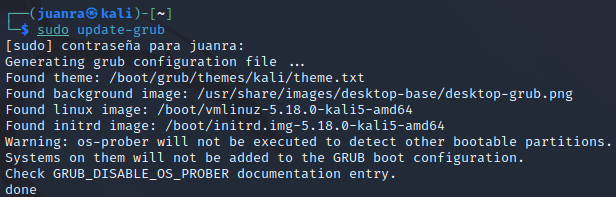
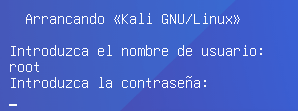

author: Juan Ramón González Hurtado
summary: Guía para bastionado de GRUB
id: hardening_guia_grub
categories: codelab,markdown 
environments: Web 
status: Published 

# Bastionado del GRUB

## Ocultación del gestor de arranque GRUB

GRUB es un gestor de arranque que se suele instalar por defecto en los sistemas linux y posee ciertas vulnerabilidades que podríamos solucionar. En primer lugar tenemos que acceder al archivo de configuración de GRUB

Se encuentra en el directorio <b>/etc/default/grub</b>, para editarlo introducimos el comando `sudo nano /etc/default/grub`

Cambiamos <b>GRUB_TIMEOUT=5</b> a <b>GRUB_TIMEOUT=0</b>

Guardamos los cambios en el archivo y ejecutamos el comando `sudo grub-update`

## Establecer una contraseña de arranque

Otra posible capa de seguridad sería establecer una contraseña de arranque. Para proteger el arranque con una contraseña editamos el archivo de configuración `/etc/grub.d/40_custom`:

Importante guardar los cambios ejecutando `sudo grub-update`:

Como podemos comprobar nos pide la contraseña de arranque:

## Sección 1 
Duration: 0:10:00
 
### Cajas de información 
Texto plano dentro de cajas de información verdes y amarillas 
 
Negative 
: Esto aparecerá en una caja de información amarilla.
 
Positive 
: Esto aparecerá en una caja de información verde. 
 
¡Ya tienes tus cajas de información creadas! 
 
### Lista con viñetas 
Texto plano en una lista con viñetas: 
 
* Hola 
* CodeLab 
* Mundo 
 
¡Ya tienes tu lista con viñetas creada! 
 
### Lista numerada 
1. Lista 
2. Utilizando 
3. Números 
 
¡Ya tienes tu lista numerada creada! 

 
## Sección 2 
Duration: 0:05:00 
 
### Añade un enlace 
¡Añadiendo un enlace! 
Ejemplo de enlace 
 
### Añade una imagen 
¡Añadiendo una imagen! 
 
!Descripción de la imagen 
 
### Incrusta un iframe 
 
!https://codepen.io/tzoght/embed/yRNZaP
